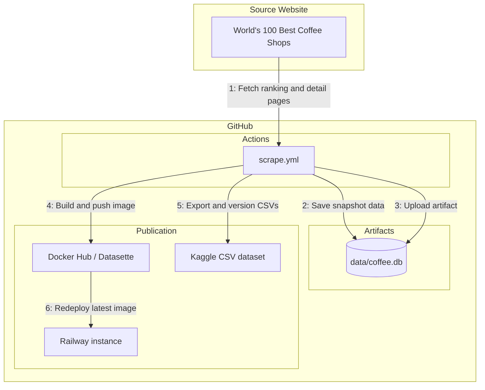

# coffeedb

coffeedb is a small SQLite-backed scraper for the World's 100 Best Coffee Shops website. It can capture the current live ranking, replay archived list/detail pages from the Wayback Machine, and keep each scrape as a dated snapshot so ranking and detail changes remain queryable over time.

## How This Works



## Quick start

### Install

```bash
uv sync
```

This project uses uv and requires Python 3.13 or newer.

### Initialize a database

```bash
uv run coffeedb init --db data/coffee.db
```

### Scrape the live site

```bash
uv run coffeedb scrape live --db data/coffee.db
```

### Scrape historical snapshots from Wayback

```bash
uv run coffeedb scrape historical --db data/coffee.db
```

## CLI overview

### `coffeedb init`

Creates the SQLite schema. It is safe to re-run on a new database.

Important: the current schema compatibility check is intentionally simple. If the database shape does not match the expected final schema, the code drops the old tables and recreates them. That keeps the project easy to reason about, but it is destructive for incompatible old databases. Back up an existing database before re-initializing it.

### `coffeedb scrape live`

Fetches the current list page and then each detail page from the live site. Each run creates or reuses today's snapshot and stores:

- the list-page rank and display fields shown on the ranking page
- the parsed detail fields from the shop page
- the detail page URL used for that scrape

### `coffeedb scrape historical`

Uses the Wayback CDX API to find archived list pages, then requests archived list and detail pages from the Wayback Machine.

Useful options:

- `--fresh`: bypass the local HTTP cache

## Data sources and scraper assumptions

The scraper is tied to the current HTML structure used by the site.

- List pages are expected to expose shops inside Elementor loop items.
- Detail pages are expected to expose the main content inside a `single-post` Elementor container.
- Contact details are most reliable under the `Contact` section.
- Missing city/country values are inferred from the address when possible.

These heuristics are deliberate. The code prefers a few explicit parsing rules over a generic parser that is harder to debug.

## Cache behavior

HTTP requests go through a small on-disk cache backed by `hishel`.

- Responses are cached using an `always_cache` policy.
- Successful `GET` responses are cached regardless of origin cache headers.
- `--fresh` bypasses the cache for that command.

Environment variables:

- `COFFEEDB_CACHE_DIR`: override the cache directory. Default: `.cache/`

## Automation

GitHub Actions workflow [.github/workflows/scrape.yml](.github/workflows/scrape.yml) runs weekly or manually and follows the same publication pattern as passportindexdb.

Workflow behavior:

- restores the latest `coffee-db` artifact when available (so snapshots accumulate)
- sets up Python and `uv`
- runs `uv run coffeedb init --db data/coffee.db`
- runs `uv run coffeedb scrape live --db data/coffee.db`
- validates SQLite integrity and latest snapshot rank coverage
- uploads `data/coffee.db` as a workflow artifact (`coffee-db`)
- builds and pushes `ngshiheng/coffeedb:latest` and a UTC date-tagged Datasette image to Docker Hub
- exports `latest_ranking.csv`, `ranking_history.csv`, `shops.csv`, and `snapshots.csv`
- publishes a new version of the Kaggle dataset
- redeploys the configured Railway Datasette service

Run it manually from Actions:

1. Open the `Scrape latest data` workflow.
2. Click `Run workflow`.

Local commands stay the source of truth for scraper behavior; the workflow simply automates the same CLI entrypoints.

### Publication setup

The scrape workflow requires these repository secrets:

- `DOCKERHUB_TOKEN`: Docker Hub access token with permission to push `ngshiheng/coffeedb`
- `KAGGLE_USERNAME`: Kaggle account username
- `KAGGLE_API_TOKEN`: Kaggle API token passed to the current Kaggle CLI
- `RAILWAY_TOKEN`: Railway API token
- `RAILWAY_PROJECT_ID`, `RAILWAY_ENVIRONMENT_ID`, `RAILWAY_SERVICE_ID`: the existing Railway Datasette service identifiers

Initial setup:

1. Create the Docker Hub repository `ngshiheng/coffeedb`.
2. Create the Kaggle dataset once with `make kaggle-export` followed by `make kaggle-create`. Later runs publish new versions automatically.
3. Create and successfully deploy a Railway service configured to use `ngshiheng/coffeedb:latest`.
4. Add the secrets above in the repository settings.

The publication stage fails when any publication secret is missing. The validated SQLite artifact is uploaded before publication, so scraping history remains available while credentials are being configured. GitHub Actions artifacts retain the database for 90 days; they are not a permanent backup.

## Project structure

```text
src/coffeedb/
	cli.py          Typer commands and scrape/query orchestration
	constants.py    Shared URLs, timeouts, and helper URL builders
	db.py           SQLite schema and persistence helpers
	kaggle.py       Current and historical CSV export views
	scraper.py      HTML parsing for list and detail pages
	wayback.py      CDX lookup and archived page fetching
```

## Database design

The database is temporal by design. The same shop can appear in many snapshots, and each snapshot can preserve both rank and detail data as they existed at that time.

Core rules:

- `shops` stores stable identity by slug
- `snapshots` stores when and where a collection came from
- `rankings` stores the list-page state for one shop in one snapshot
- `shop_details` stores the parsed detail-page state for one shop in one snapshot

This means a shop can change rank, name formatting, country text, address, or links over time without overwriting prior history.
